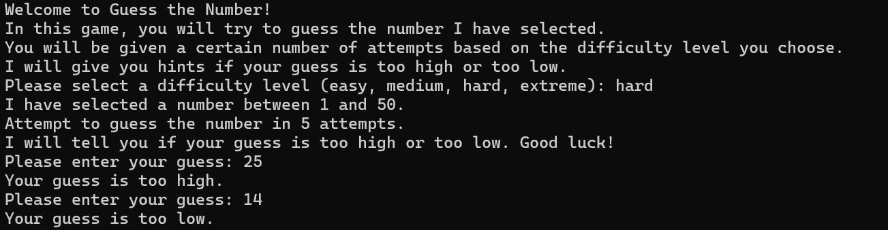

# GuessTheNumber

A number guessing game built in Python. Pick a difficulty, try to guess the computer's randomly selected number within a limited number of attempts, and get your stats across sessions.

## How It Works

- The computer picks a random number based on your chosen difficulty
- After each guess, you're told whether your guess was too high or too low
- Guess correctly within the attempt limit to win — accuracy is calculated based on how many attempts you had left
- Run out of attempts and it's a loss, with the correct number revealed
- Global counters track your stats across every round played this session, shown after each game



## Features

- **Introduction** - prints introduction messages with time.sleep() used to make game feel more natural
- **Four difficulty levels**, each with its own range of numbers and attempt limit (eg. in 'easy' mode, you guess from 1-5 with 3 attempts)
- **Input validation** — rejects bad/invalid input and out-of-range guesses <ins>without</ins> costing you an attempt
- **Hints** after every guess ("too high" / "too low")
- **Accuracy scoring** based on how few guesses it took you to win
- **Session statistics** — games played / wins / win rate / average accuracy (tracked across <ins>multiple</ins> rounds)
- **Replayable** — keep playing round after round without restarting the session.

## Difficulty Levels

| Difficulty | Number Range | Max Attempts |
|------------|--------------|---------------|
| Easy       | 1–5          | 3             |
| Medium     | 1–20         | 4             |
| Hard       | 1–50         | 5             |
| Extreme    | 1–100        | 6             |

## Usage

Run the game from the terminal:

```bash
python guess_the_number.py
```

Follow the prompts to select a difficulty, then start guessing.

## Author

Built by [tharunkrsh](https://github.com/tharunkrsh)
